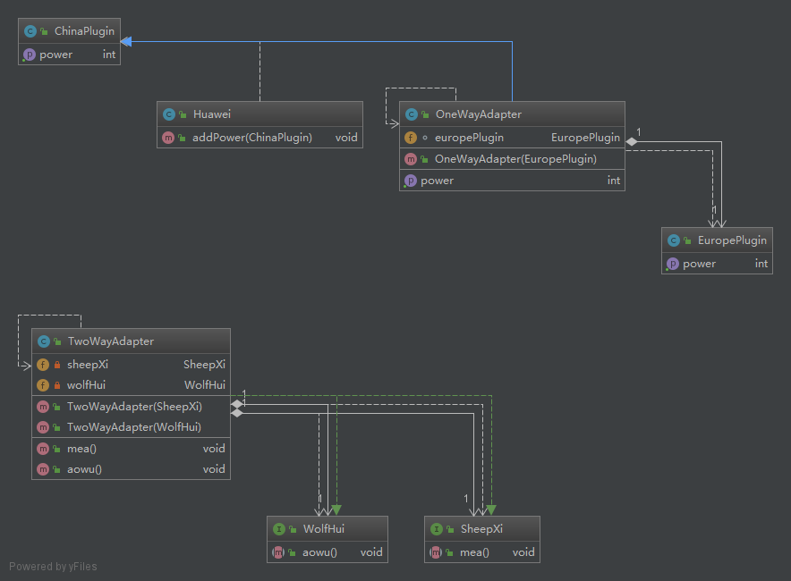

*适配器模式*

模式定义
========

问题需求描述
============

设计类图
========



Code
====

#### 单向适配器

我们模拟一个给华为手机充电的行为

Huawei.java

```java
package Adapter;

public class Huawei {
    public void addPower(ChinaPlugin chinaPlugin) {
        System.out.println("get power " + chinaPlugin.getPower() + "!");
    }
}
```

ChinaPlugin.java

```java
package Adapter;

public class ChinaPlugin {
    public int getPower() {
        return 100;
    }
}
```

EuropePlugin.java

```java
package Adapter;

public class EuropePlugin {
    public int getPower() {
        return 50;
    }
}
```

OneWayAdapter.java

```java
package Adapter;

public class OneWayAdapter extends ChinaPlugin {
    EuropePlugin europePlugin;

    public OneWayAdapter(EuropePlugin europePlugin) {
        this.europePlugin = europePlugin;
    }

    @Override
    public int getPower() {
        return europePlugin.getPower();
    }
}
```

#### 双向适配器

我们模拟一个披着狼皮的羊和披着羊皮的狼的行为

SheepXi.java

```java
package Adapter;

public interface SheepXi {
    void mea();
}
```

WolfHui.java

```java
package Adapter;

public interface WolfHui {
    void aowu();
}
```

TwoWayAdapter.java

```java
package Adapter;

public class TwoWayAdapter implements SheepXi, WolfHui {
    private SheepXi sheepXi;
    private WolfHui wolfHui;

    @Override
    public void mea() {
        wolfHui.aowu();
    }

    @Override
    public void aowu() {
        sheepXi.mea();
    }

    public TwoWayAdapter(SheepXi sheepXi) {
        this.sheepXi = sheepXi;
        this.wolfHui = null;
    }

    public TwoWayAdapter(WolfHui wolfHui) {
        this.wolfHui = wolfHui;
        this.sheepXi = null;
    }
}
```

运行结果
========

#### 单向适配器模式Main

```java
public class Main {
    public static void main(String[]argv) {
        EuropePlugin europePlugin = new EuropePlugin();
        Huawei huawei = new Huawei();
        ChinaPlugin chinaPlugin = new ChinaPlugin();
        OneWayAdapter oneWayAdapter = new OneWayAdapter(europePlugin);
        huawei.addPower(oneWayAdapter);
    }
}
```

out

```text
get power 50!
```

#### 双向适配器

```java
package Adapter;

class Wolf implements WolfHui {

    @Override
    public void aowu() {
        System.out.println("aowu~~");
    }
}

class Sheep implements SheepXi {

    @Override
    public void mea() {
        System.out.println("mea~~~");
    }
}

public class Main {
    public static void main(String[] args) {
        Wolf wolf = new Wolf();
        wolf.aowu();
        Sheep sheep = new Sheep();
        sheep.mea();
        SheepXi sheepXi = new TwoWayAdapter(wolf);
        sheepXi.mea();
        WolfHui wolfHui = new TwoWayAdapter(sheep);
        wolfHui.aowu();
    }
}

```

out

```text
aowu~~
mea~~~
aowu~~
mea~~~
```
