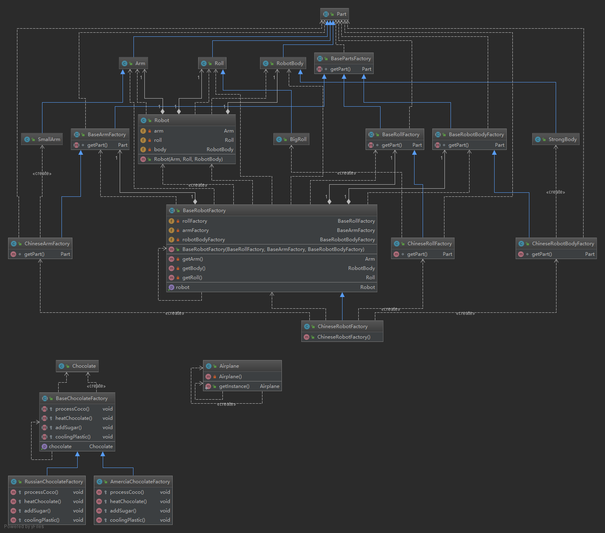

工厂 Factory
============

UML
---



#简单工厂

模式定义
--------

问题描述
--------

模拟一个飞机的生产线

Code
----

Airplane.java

```java
package Factory.SimpleFactory;

public class Airplane {
    private Airplane() {
        System.out.println("add roll");
        System.out.println("add wing");
        System.out.println("add engine");
    }

    public static Airplane getInstance() {
        return new Airplane();
    }

    public static void main(String[]argv) {
        Airplane airplane = Airplane.getInstance();
    }
}
```

运行结果
--------

```text
add roll
add wing
add engine
```

工厂模式
========

模式定义
--------

问题描述
--------

模拟一个美国巧克力和俄罗斯巧克力工厂

Code
----

Chocolate.java

```java
package Factory.FactoryMode;

public class Chocolate {
}
```

BaseChocolateFactory.java\`\``java package Factory.FactoryMode;

public abstract class BaseChocolateFactory { public Chocolate getChocolate() { Chocolate chocolate = new Chocolate(); processCoco(); heatChocolate(); addSugar(); coolingPlastic(); return chocolate; }

```
protected abstract void processCoco();

protected abstract void heatChocolate();

protected abstract void addSugar();

protected abstract void coolingPlastic();
```

\}\`\`\`

RussianChocolateFactory.java

```java
package Factory.FactoryMode;

public class RussianChocolateFactory extends BaseChocolateFactory {
    @Override
    protected void processCoco() {
        System.out.println("process russian coco.");
    }

    @Override
    protected void heatChocolate() {
        System.out.println("heat Chocolate to melt.");
    }

    @Override
    protected void addSugar() {
        System.out.println("add many sugar.");
    }

    @Override
    protected void coolingPlastic() {
        System.out.println("cooling until plastic by circle template.");
    }
}
```

AmerciaChocolateFactory.java

```java
package Factory.FactoryMode;

public class AmerciaChocolateFactory extends BaseChocolateFactory {
    @Override
    protected void processCoco() {
        System.out.println("process america coco.");
    }

    @Override
    protected void heatChocolate() {
        System.out.println("heat to just a little melt.");
    }

    @Override
    protected void addSugar() {
        System.out.println("add Capitalist sugar.");
    }

    @Override
    protected void coolingPlastic() {
        System.out.println("cooling until it shape by triangle.");
    }
}

```

~~由于实在是太复杂我就不写怎么运行的了~~

抽象工厂
========

模式定义
--------

问题描述
--------

模拟一个中国制造2025生产的超级牛逼的机器人

机器人的身体, 胳膊, 轮子来自不同的工厂

Code
----

Arm.java

```java
package Factory.AbstractFactory;

public class Arm extends Part {
}
```

BaseArmFactory.md

```java
package Factory.AbstractFactory;

public abstract class BaseArmFactory extends BasePartsFactory {
    @Override
    abstract Part getPart();
}
```

BasePartsFactory.java

```java
package Factory.AbstractFactory;

public abstract class BasePartsFactory {
    abstract Part getPart();
}
```

BaseRobotBodyFactory.java

```java
package Factory.AbstractFactory;

public abstract class BaseRobotBodyFactory extends BasePartsFactory {
    @Override
    abstract Part getPart();
}
```

BaseRobotFactory.java

```java
package Factory.AbstractFactory;

public abstract class BaseRobotFactory {
    private BaseRollFactory rollFactory;
    private BaseArmFactory armFactory;
    private BaseRobotBodyFactory robotBodyFactory;

    public BaseRobotFactory(BaseRollFactory rollFactory,
                            BaseArmFactory armFactory,
                            BaseRobotBodyFactory robotBodyFactory) {
        this.rollFactory = rollFactory;
        this.armFactory = armFactory;
        this.robotBodyFactory = robotBodyFactory;
    }

    public Robot getRobot() {
        return new Robot(getArm(), getRoll(), getBody());
    }

    private Arm getArm() {
        return (Arm) armFactory.getPart();
    }

    private RobotBody getBody() {
        return (RobotBody) robotBodyFactory.getPart();
    }

    private Roll getRoll() {
        return (Roll) rollFactory.getPart();
    }
}
```

BaseRollFactory.java

```java

package Factory.AbstractFactory;

public abstract class BaseRollFactory extends BasePartsFactory {
    @Override
    abstract Part getPart();
}
```

BigRoll.java

```java
package Factory.AbstractFactory;

public class BigRoll extends Roll {
}
```

ChineseArmFactory.java\`\``java package Factory.AbstractFactory;

public class BigRoll extends Roll { }\`\`\`

ChineseRobotBodyFactory.java

```java
package Factory.AbstractFactory;

public class ChineseRobotBodyFactory extends BaseRobotBodyFactory {
    @Override
    Part getPart() {
        return new StrongBody();
    }
}
```

ChineseRobotFactory.java

```java
package Factory.AbstractFactory;

public class ChineseRobotFactory extends BaseRobotFactory {
    public ChineseRobotFactory() {
        super(new ChineseRollFactory(), new ChineseArmFactory(), new ChineseRobotBodyFactory());
    }
}
```

ChineseRollFactory.java

```java
package Factory.AbstractFactory;

public class ChineseRollFactory extends BaseRollFactory {

    @Override
    Part getPart() {
        return new BigRoll();
    }
}

```

Part.java

```java
package Factory.AbstractFactory;

public abstract class Part {
}
```

Robot.java

```java
package Factory.AbstractFactory;

public class Robot {
    private Arm arm;
    private Roll roll;
    private RobotBody body;

    public Robot(Arm arm, Roll roll, RobotBody body) {
        this.arm = arm;
        this.roll = roll;
        this.body = body;
    }
}
```

RobotBody.java

```java
package Factory.AbstractFactory;

public class RobotBody extends Part {
}
```

Roll.java

```java
package Factory.AbstractFactory;

public class Roll extends Part {
}
```

SmallArm.java

```java
package Factory.AbstractFactory;

public class SmallArm extends Arm {
}
```

StrongBody.java

```java
package Factory.AbstractFactory;

public class StrongBody extends RobotBody {
}

```

~~由于实在是太复杂我就不写怎么运行的了~~
