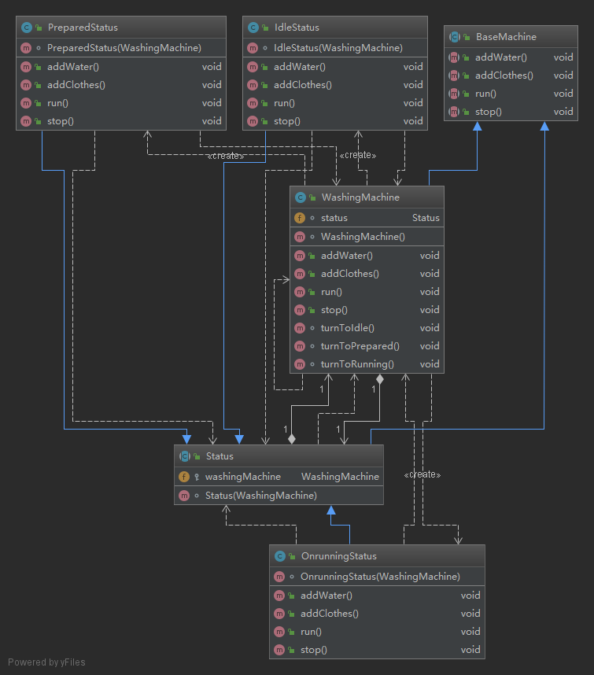

状态模式

模式定义
========

问题描述
========

模拟洗衣机

有三个状态:

1.	空闲:可以添加衣服,加水
2.	准备好了, 可以洗衣服了:可以运行
3.	洗衣服中...:可以停止

UML 类图
========



Code
====

BaseMachine.java

```java
package Status;

public abstract class BaseMachine {
    public abstract void addWater();

    public abstract void addClothes();

    public abstract void run();
    public abstract void stop();
}
```

IdleStatus.java

```java
package Status;

public class IdleStatus extends Status {
    IdleStatus(WashingMachine washingMachine) {
        super(washingMachine);
    }

    @Override
    public void addWater() {
        System.out.println("add water.");
        washingMachine.turnToPrepared();
    }

    @Override
    public void addClothes() {
        System.out.println("add clothes.");
        washingMachine.turnToPrepared();
    }

    @Override
    public void run() {
        System.out.println("cannnot run!");
    }

    @Override
    public void stop() {
        System.out.println("always stop.");
    }
}
```

OnrunningStatus.java

```java
package Status;

public class OnrunningStatus extends Status {
    OnrunningStatus(WashingMachine washingMachine) {
        super(washingMachine);
    }

    @Override
    public void addWater() {
        System.out.println("running.");
    }

    @Override
    public void addClothes() {
        System.out.println("running.");
    }

    @Override
    public void run() {
        System.out.println("i was run..");
    }

    @Override
    public void stop() {
        System.out.println("stop!");
        washingMachine.turnToIdle();
    }
}
```

PreparedStatus.java

```java
package Status;

public class PreparedStatus extends Status {
    PreparedStatus(WashingMachine washingMachine) {
        super(washingMachine);
    }

    @Override
    public void addWater() {
        System.out.println("have prepared!");
    }

    @Override
    public void addClothes() {
        System.out.println("have prepared!");
    }

    @Override
    public void run() {
        System.out.println("run...");
        washingMachine.turnToRunning();
    }

    @Override
    public void stop() {
        System.out.println("always stop..");
    }
}
```

Status.java

```java
package Status;

public abstract class Status extends BaseMachine {
    protected WashingMachine washingMachine;

    Status(WashingMachine washingMachine) {
        this.washingMachine = washingMachine;
    }
}
```

WashingMachine.java

```java
package Status;

public class WashingMachine extends BaseMachine {
    Status status;

    WashingMachine() {
        status = new IdleStatus(this);
    }

    @Override
    public void addWater() {
        status.addWater();
    }

    @Override
    public void addClothes() {
        status.addClothes();
    }

    @Override
    public void run() {
        status.run();
    }

    @Override
    public void stop() {
        status.stop();
    }

    void turnToIdle() {
        status = new IdleStatus(this);
    }

    void turnToPrepared() {
        status = new PreparedStatus(this);
    }

    void turnToRunning() {
        status = new OnrunningStatus(this);
    }

}
```

运行结果
========

Main.java

```java
package Status;

public class Main {
    public static void main(String[] args) {
        WashingMachine washingMachine = new WashingMachine();
        washingMachine.run();
        washingMachine.addWater();
        washingMachine.run();
        washingMachine.addClothes();
        washingMachine.run();
        washingMachine.stop();
    }
}
```

out

```
cannnot run!
add water.
run...
running.
i was run..
stop!
```
