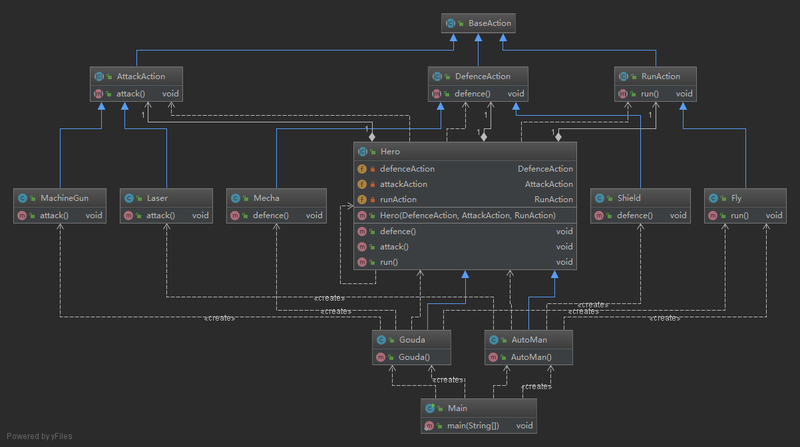

策略模式

模式定义
========

问题需求描述
============

模拟一个奥特曼和高达, 他们有Attack, Defence, Run三种动作

UML
===



Code
====

Hero.java

```java
package Strategy;

public abstract class Hero {
    private DefenceAction defenceAction;
    private AttackAction attackAction;
    private RunAction runAction;

    public Hero(DefenceAction defenceAction, AttackAction attackAction, RunAction runAction) {
        this.defenceAction = defenceAction;
        this.attackAction = attackAction;
        this.runAction = runAction;
    }

    public void defence() {
        defenceAction.defence();
    }

    public void attack() {
        attackAction.attack();
    }

    public void run() {
        runAction.run();
    }
}
```

Gouda.java

```java
package Strategy;

public class Gouda extends Hero{
    public Gouda() {
        super(new Mecha(), new MachineGun(), new Fly());
    }
}
```

AutoMan.java

```java
package Strategy;

public class AutoMan extends Hero {
    public AutoMan() {
        super(new Shield(),new Laser(),new Fly());
    }
}
```

BaseAction.java

```java
package Strategy;

public abstract class BaseAction {
}
```

DefenceAction.java

```java
package Strategy;

public abstract class DefenceAction extends BaseAction{
    public abstract void defence();
}
```

AttackAction.java

```java
package Strategy;

public abstract class AttackAction extends BaseAction {
    public abstract void attack();
}
```

RunAction.java

```java
package Strategy;

public abstract class RunAction extends BaseAction {
    public abstract void run();
}
```

Fly.java

```java
package Strategy;

public class Fly extends RunAction {

    @Override
    public void run() {
        System.out.println("good bye!!");
    }
}
```

MachineGun.java

```java
package Strategy;

public class Laser extends AttackAction {
    @Override
    public void attack() {
        System.out.println("biubiubiu!!!");
    }
}
```

Mecha.java

```java
package Strategy;

public class Mecha extends DefenceAction {

    @Override
    public void defence() {
        System.out.println("Mecha defence!");
    }
}
```

Shield.java

```java
package Strategy;

public class Shield extends DefenceAction {
    @Override
    public void defence() {
        System.out.println("ha!!");
    }
}
```

运行结果
========

Main.java

```java
package Strategy;

public class Main {
    public static void main(String[] args) {
        AutoMan autoMan = new AutoMan();
        Gouda gouda = new Gouda();
        System.out.println("now is automan!");
        autoMan.attack();
        autoMan.defence();
        autoMan.run();
        System.out.println("now is gouda!!");
        gouda.attack();
        gouda.defence();
        gouda.run();
        System.out.println("finish!");
    }
}
```

out

```
now is automan!
biubiubiu!!!
ha!!
good bye!!
now is gouda!!
boom!boom!boom!!!
Mecha defence!
good bye!!
finish!
```
